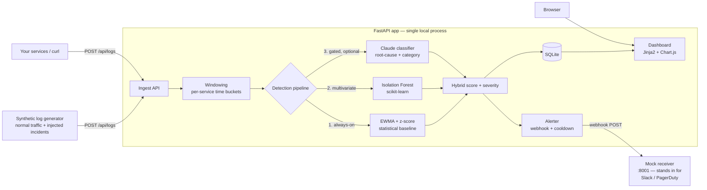

# 🛰️ SRE Event Watchdog

> **An API-first observability service that watches application logs in real time and uses a hybrid statistical + ML + LLM pipeline to catch incidents, explain their probable root cause, and fire alerts — before a human notices.**

Fully self-contained and **100% local**: SQLite + localhost + a built-in synthetic log generator. One command brings up the API, a live dashboard, a mock alert receiver, and traffic with injected incidents. **No cloud resources to provision or decommission, no API keys required** — the GenAI layer is feature-flagged and degrades gracefully when absent.

---

## Why this exists

On-call SREs drown in logs. Pure-threshold alerting is noisy; pure-ML is a black box; pure-LLM is slow and expensive at log scale. This service is built around the judgment that **the right answer is layered** — cheap detectors run on everything, and the expensive LLM only runs on what already looks suspicious.

---

## Architecture



### Why the hybrid stats + ML + LLM design

This layering is the core engineering judgment of the project:

| Layer | Role | Why it's there | Cost |
|-------|------|----------------|------|
| **1. EWMA + z-score** | Per-feature statistical baseline, online | Instant signal, cold-start friendly, fully interpretable. Catches obvious spikes with zero training. | ~free |
| **2. Isolation Forest** | Multivariate ML on `[count, error_rate, latency_mean, latency_p95, latency_std]` | Catches *contextual* anomalies a single-feature z-score misses (e.g. normal volume but skewed latency distribution). | cheap |
| **3. LLM classifier** | Root-cause category + recommended action, **structured output** | Turns a numeric anomaly into an explanation an on-call engineer can act on. **Cost-gated: only runs when layers 1/2 already flagged the window.** | gated |

### Detection tuning (measured, not guessed)

The statistical threshold was set empirically. Bursty low-count features (a single
80-log bucket with 3-4 errors against a 1% baseline) inflate single-bucket
z-scores, so a naive `z>3` flagged ~17% of *healthy* windows. Measuring the
healthy `top_z` distribution (max ≈ 7.8) vs. incident onset (z in the hundreds)
showed a wide gap, so the default is `z=6`: healthy false positives drop to ~1%,
their scores stay below the alert threshold (so noise never pages), and real
incidents still flag every bucket. The Isolation Forest layer keeps a small,
realistic ~1% residual — an honest anomaly detector has some false positives;
this one keeps them low-severity and non-paging.

**This is the GenAI craft the build is optimized to show:**
- The LLM is **not** in the hot path for every log — it's gated behind cheap detectors, the way you'd actually run it in production to control cost and latency.
- It returns **structured output** (tool-use / JSON schema), not free text, so its verdict is machine-usable.
- It has a **clean fallback**: with `WATCHDOG_LLM_ENABLED=false` or no `ANTHROPIC_API_KEY`, the app behaves identically minus the enrichment. The dashboard shows the flag state so reviewers can see it switch on and off.

---

## Quickstart

```bash
# 1. Clone, then from the project root:

# macOS / Linux
./scripts/run.sh

# Windows (PowerShell)
./scripts/run.ps1
```

The script creates a virtualenv, installs dependencies, starts the mock alert receiver, and launches the app. Then open:

| What | URL |
|------|-----|
| 📊 **Dashboard** (live charts) | http://localhost:8000/ |
| 📚 **Interactive API docs** | http://localhost:8000/docs |
| ❤️ **Health / pipeline stats** | http://localhost:8000/api/health |
| 📨 **Mock alert receiver** | http://localhost:8001/received |

Within ~1 minute the generator injects an incident, the detectors trip, an alert lands in the mock receiver, and the dashboard charts spike.

### Enable the LLM layer (optional)

```bash
export WATCHDOG_LLM_ENABLED=true
export ANTHROPIC_API_KEY=sk-ant-...      # default model: claude-haiku-4-5
```

Without these, everything still runs on the stats + ML layers.

---

## Demo

> _Screenshot / GIF placeholder — anomalies firing on the live dashboard:_
>
> 
>
> _(Replace `docs/demo.gif` with a capture of the dashboard during an injected incident.)_

---

## API surface

| Method | Path | Purpose |
|--------|------|---------|
| `POST` | `/api/logs` | Ingest one log or a batch |
| `GET`  | `/api/anomalies` | Recent anomalies (filter by service / severity) |
| `GET`  | `/api/alerts` | Fired alerts + delivery status |
| `GET`  | `/api/stats/timeseries` | Timeseries powering the dashboard |
| `POST` | `/api/demo/inject` | Manually inject an incident for a live demo |
| `GET`  | `/api/health` | Liveness + pipeline stats |
| `GET`  | `/` | Server-rendered dashboard |

Full interactive schema at **`/docs`**.

---

## Vibe-coding process

This project was built **end-to-end with Claude Code under a "no manual edits" rule** — every line of code and every fix came from the AI; the human acted purely as lead architect.

📝 **The full prompt-by-prompt audit trail lives in [`prompts.md`](prompts.md)** — every instruction given, verbatim, with timestamps and a one-line summary of what changed. The design contract is in [`SPEC.md`](SPEC.md), which was reviewed and approved before any code was written.

### Engineering judgment, not just code generation

The interesting part of an AI-built system is *how the hard calls were made*. Four decisions from this build (all traceable in [`prompts.md`](prompts.md)) show the difference between generating code and engineering a system:

- **EWMA `alpha` tuning (measured, not guessed).** A test surfaced that with `alpha=0.3` the statistical baseline converged too slowly — a real incident wouldn't trip the threshold within the demo's ~1-minute window. The fix was to raise `alpha` to `0.4` (~2.5-window half-life) for the right responsiveness/smoothing trade-off — **a genuine model-tuning decision, not adjusting the test to pass.**

- **Isolation Forest constant-feature root cause.** When a multivariate outlier scored *below* the threshold, the first instinct was to add a `StandardScaler` — but identical 16-digit float output proved it was a no-op (IF is invariant to monotonic per-feature transforms). That dead end was **reverted rather than left in as misleading code**, and the real cause found: the *test's* training data held 3 of 5 features constant, so IF couldn't split on them. The fix corrected the test to reflect realistic noise.

- **Honest false-positive rate.** Healthy traffic was producing ~15% false anomalies. Rather than guess, the raw `top_z` distribution was *measured* (healthy maxes at ~7.8σ; real incidents hit the hundreds), and `z_threshold` was raised to 6 — cutting false positives to ~1% with none crossing the alert threshold. The residual ~1% Isolation Forest false-positive rate was **deliberately left in and documented rather than faked to zero** — an honest anomaly detector has some false positives.

- **httpx 0.28 `ASGITransport` is async-only.** A silently-failing webhook delivery test was root-caused to a real SDK behavior change (sync clients can no longer drive an ASGI app via `ASGITransport`) and fixed by injecting Starlette's `TestClient` as the sync→ASGI bridge — **a production-code-free fix**, since the alerter duck-types its client.

This is a deliberate, spec-first, auditable AI-assisted workflow with measurement-driven debugging — the same discipline a Forward Deployed engineer brings to building with customers.

---

## Tech stack

Python 3.11+ · FastAPI · SQLite (stdlib `sqlite3`) · scikit-learn · NumPy · Jinja2 + Chart.js · httpx · Anthropic SDK (optional) · pytest.

---

## Testing


```bash
.venv/bin/python -m pytest        # or .venv\Scripts\python -m pytest on Windows
```

**34 tests**, all passing. Coverage spans the EWMA/z-score detector math, Isolation Forest warmup + multivariate detection, windowing aggregation, ingestion validation, alerter cooldown + real delivery to the mock receiver, the synthetic generator's incident scenarios, the dashboard timeseries contract, and the LLM layer — including its strict-tool-use wiring, error-swallowing fallback, and disabled-no-key path. The LLM and webhook tests use injected fakes / ASGI transport, so the whole suite runs with **no API key and no network**.

---

## Production hardening / what I'd do next

This is a focused MVP. To run it for real I would:

- **Ingestion at scale**: put a queue (Kafka/Redis Streams) in front of detection; batch writes; move off SQLite to Postgres/Timescale or a TSDB for the windows table.
- **Detector lifecycle**: persist & version Isolation Forest models, scheduled retraining, drift monitoring, per-service model isolation, and backtesting against labeled incidents.
- **LLM layer**: response caching + token budgets, prompt/version pinning, eval harness for classification quality, and a human-feedback loop to tune categories.
- **Alerting**: real integrations (Slack/PagerDuty/Opsgenie), dedup/grouping, escalation policies, and alert acknowledgement tracking.
- **Reliability & security**: auth (API keys/OIDC) on ingest, rate limiting, input validation hardening, structured logging + metrics for the watchdog itself ("who watches the watchdog"), and health/readiness probes.
- **Delivery**: Dockerfile + compose, CI (lint/type-check/test), and a Helm chart for k8s.
- **Product**: configurable detection thresholds per service in the UI, anomaly feedback (true/false positive) feeding back into tuning, and SLO-aware alerting.

---

_Built as a take-home / portfolio project to demonstrate Forward Deployed / GenAI engineering: spec-first design, layered detection judgment, cost-aware LLM integration, and an end-to-end runnable product._
