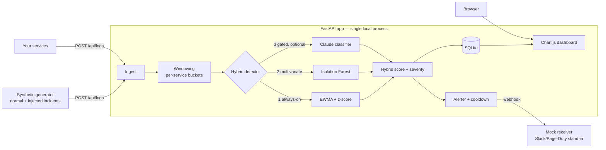

<!-- _paginate: false -->

# 🛰️ SRE Event Watchdog

### Intelligent Observability & Event Watchdog

An **API-first** service that watches application logs in real time and uses a
**hybrid statistical + ML + LLM** pipeline to catch incidents, explain their
probable root cause, and fire alerts — **before a human notices**.

**Fully local · one command · no API key required**

<br>

_Forward Deployed / GenAI Engineer challenge — built end-to-end with Claude Code_

---

## The problem: alert fatigue & late detection

On-call SREs drown in logs, and the tooling makes it worse:

- **Pure-threshold alerting** is noisy → engineers tune it out, real incidents slip through
- **Pure-ML** is a black box → a score with no "why," no action
- **Pure-LLM** is slow and expensive at log scale → can't sit in the hot path

> Incidents get noticed late, and when they're noticed, the on-call still has to
> reverse-engineer *what broke* and *what to do*.

**The bet:** the right answer is **layered** — cheap detectors run on everything,
the expensive LLM runs only on what already looks suspicious.

---

## Architecture



Logs → per-service time windows → 3-layer detection → persist → **alert + live dashboard**.

---

## Why the hybrid design (the judgment)

| Layer | Role | Why it's there | Cost |
|-------|------|----------------|------|
| **1. EWMA + z-score** | Online statistical baseline | Instant signal, cold-start safe, interpretable. Baseline **frozen during incidents** so sustained outages keep flagging. | ~free |
| **2. Isolation Forest** | Multivariate ML | Catches *contextual* anomalies a single-feature z-score misses. Flagged windows kept out of training. | cheap |
| **3. Claude classifier** | Root-cause triage | Turns a number into an explanation + recommended action. **Gated behind layers 1–2.** | gated |

**Cheap → expensive.** The costly layer only runs on what's already suspicious —
the way you'd actually run it in production.

---

## The GenAI layer — production-shaped

The dimension the build is optimized to showcase:

- **Structured output via strict tool use** — a forced `report_root_cause` tool
  with an enum-constrained schema: `category`, `probable_root_cause`,
  `severity`, `recommended_action`, `confidence`. Machine-usable, not free text.
- **Cost-gated** — only fires on windows the cheap detectors already flagged.
- **Clean no-key fallback** — without `ANTHROPIC_API_KEY` the SDK isn't even
  imported; the app behaves identically on stats + ML. **It always runs.**
- **Feeds back into alerting** — a `noise` verdict **suppresses the page**.

> `claude-haiku-4-5` by default (fast/cheap for enrichment); model is configurable.

---

## Live demo — one command

```bash
./scripts/run.ps1        # Windows   (./scripts/run.sh on macOS/Linux)
```

Brings up the API + dashboard (`:8000`) and the mock alert receiver (`:8001`).

Within **~1 minute**, autonomously:

1. The generator seeds healthy history → both detectors warm up in seconds
2. An incident is injected (error burst / latency regression / dependency outage)
3. Detectors trip → **hybrid `stats+iforest` anomaly, severity `high`**
4. An alert **POSTs to the mock receiver** (swap the URL for real Slack/PagerDuty)
5. The **dashboard lights up** — volume, error rate, latency p95, anomaly score

Trigger one on demand: **`POST /api/demo/inject`** — or click "Inject incident" in the UI.

---

## Results

- **34 tests passing** — detector math, windowing, alerting + delivery, generator
  scenarios, dashboard contract, and the LLM layer (strict-tool-use, fallback,
  no-key path). Runs with **no key and no network**.
- **2-layer hybrid detection** confirmed live: injected incident → `iforest high
  score 0.96` → alert delivered to the mock receiver.
- **Measured tuning:** healthy false positives cut **~15% → ~1%** by measuring the
  z-score distribution (not guessing); residual ~1% left in honestly.
- **CI green** on Python 3.11 + 3.12 (ruff lint + pytest).
- **~10× test-suite speedup** (159s → 15s) from a thread-local SQLite pool.

---

## Vibe-coding process — engineering judgment

Built **end-to-end with Claude Code under a "no manual edits" rule**; full
prompt-by-prompt audit trail in [`prompts.md`](../prompts.md), spec in
[`SPEC.md`](../SPEC.md). Four real debugging calls show the difference between
*generating code* and *engineering a system*:

- **EWMA `alpha` tuning** — a test showed slow convergence; raised 0.3→0.4 by
  reasoning, **not** by gaming the test.
- **Isolation Forest dead end** — added a `StandardScaler`, proved it a no-op
  (IF is scale-invariant), **reverted it**, found the real cause (constant test features).
- **False-positive rate** — *measured* the z-distribution, raised the threshold,
  and **left the honest ~1% residual** rather than fake a zero.
- **httpx 0.28 `ASGITransport`** — root-caused an async-only SDK change; fixed in
  the test, not production.

---

## Production hardening — what's next

A focused MVP. To run it for real:

- **Scale:** queue in front of ingestion; move windows off SQLite to Postgres/Timescale.
- **Detector lifecycle:** persist/version models, scheduled retraining, drift monitoring, backtesting.
- **LLM layer:** response caching + token budgets, prompt/version pinning, an eval harness, human feedback to tune categories.
- **Alerting:** real Slack/PagerDuty/Opsgenie, dedup/grouping, escalation, ack tracking.
- **Reliability & security:** auth + rate limiting on ingest, metrics for the watchdog itself, readiness probes.
- **Delivery:** Dockerfile + compose, Helm chart. _(CI already in place.)_

<br>

**Thank you** — `github.com/mallimatla/sre-event-watchdog`
